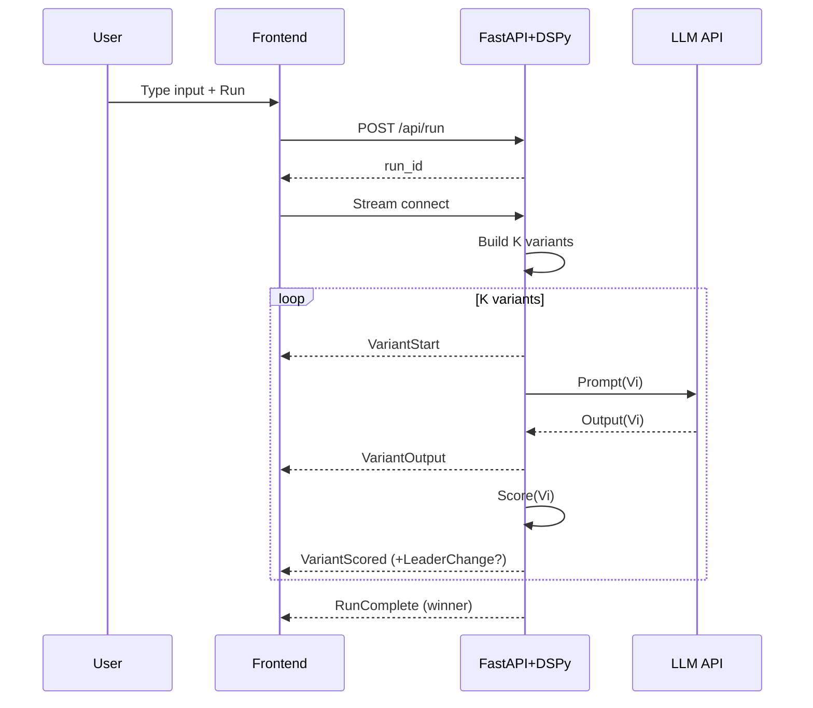

# Live Optimizing Classifier — UI Flow + Requirements

## 1) Purpose

Demonstrate DSPy’s prompt/program optimization live. Audience types real text; app animates multiple prompt variants, scores them, and “locks in” the best-performing output.

## 2) Scope

Single-task demo: short-text classification + 1-sentence summary. Visible optimization timeline. Minimal infrastructure. No external data sources.

## 3) Success Criteria

* Audience can type arbitrary input and see ≥3 prompt/program variants trialed with per-variant scores in ≤6s on standard laptop.
* Final output is highlighted with “why it won” signals (score, rule hits, eval checks).
* Replay of the last run is available instantly.
* Cold start to first successful run ≤10s.

## 4) Roles

* Presenter: drives demo, toggles “show internals.”
* Participant: types sample text.
* System: runs DSPy pipeline, surfaces variants, scores, and final selection.

---

## 5) High-Level Architecture

* Frontend: React + Framer Motion for animations.
* Backend: FastAPI + DSPy. In-memory store for runs.
* LLM Provider: pluggable (env var).
* Scoring: rule-based correctness checks + lightweight heuristics.

```text
[Browser] ⇄ [FastAPI + DSPy] ⇄ [LLM API]
                  │
             [Run Store]
```

---

## 6) Core User Flow (Happy Path)

1. Landing screen visible.
2. User enters a short sentence and presses “Run.”
3. UI shows “Compiling Options” animation; backend generates K prompt/program variants.
4. For each variant: show mini card → model output → score appears.
5. Scoreboard updates; leader bubbles to top.
6. Optimization meter reaches threshold; “Best Variant Selected” banner.
7. Final panel shows: Category, Summary, Winning Variant ID, Score breakdown.
8. User clicks “Replay” to re-animate without re-calling LLM.
9. User edits input and re-runs.

---

## 7) Screens and States

### 7.1 Landing

* Components: Title, short explainer subline, input box, “Run” button (primary), “Use Sample” (secondary), “Show Internals” toggle (off by default).
* Empty state: placeholder examples.

### 7.2 Run In-Progress

* Top bar: Input preview + elapsed time.
* Left column: Variant List (cards appear sequentially: V1, V2, V3…).
* Right column: Scoreboard (live ranking).
* Bottom ribbon: Optimization Meter (progress to selection).

### 7.3 Result

* Final Output Card:

  * Category (pill)
  * One-sentence summary
  * Winning Variant ID
  * Final Score
  * “Why it won” chips (e.g., “Label match,” “Format OK,” “No hedging”)
* Actions: Replay, Copy Result JSON, Run Again.

### 7.4 Error/Degraded

* Timeouts show per-variant skeleton and “Skipped variant (timeout).”
* If all fail, show fallback result with explanation.

---

## 8) Animation Timeline (per run, default 4.5–6.0s)

* t+0.0s: “Compiling Options” pulse.
* t+0.5s: V1 card drops in → “Querying…” → output → score pop.
* t+1.5s: V2 repeats.
* t+2.5s: V3 repeats.
* t+3.5s: Scoreboard reorders, leader expands.
* t+4.0s: Optimization Meter completes.
* t+4.2s: Final banner snap + confetti-lite (no audio).
* Replay uses cached events at 1.25× speed.

---

## 9) Functional Requirements (MoSCoW)

### Must

* Input: free text (≤500 chars), debounced, sanitized.
* At least 3 variants per run; sequential reveal.
* Deterministic scoring function with visible sub-scores.
* Final selection logic = argmax(score).
* Replay from cached event log without LLM calls.
* Toggle “Show internals” to reveal variant prompts.
* Copyable JSON for outputs and run metadata.

### Should

* Swapable task schemas (classification labels list via config).
* Rate-limit guardrails (client and server).
* Minimal offline cache for last N runs (N≥10).
* Keyboard shortcuts: Enter=Run, R=Replay.

### Could

* Dark mode.
* Save preset inputs.
* Export MP4/WebM of replay.

### Won’t

* Multi-user persistence or auth.
* Fine-tuning.
* Long-document ingestion.

---

## 10) Data Model

```json
{
  "Run": {
    "run_id": "uuid",
    "input_text": "string",
    "created_at": "iso8601",
    "variants": ["Variant"],
    "scores": ["Score"],
    "winner_variant_id": "string",
    "task_config": {
      "labels": ["billing","technical","cancellation","urgent","other"],
      "summary_required": true
    },
    "event_log": ["Event"]
  },
  "Variant": {
    "variant_id": "string",
    "prompt_spec": "string",
    "output": {
      "category": "string",
      "summary": "string"
    },
    "latency_ms": 0
  },
  "Score": {
    "variant_id": "string",
    "total": 0.0,
    "components": {
      "label_valid": 0|1,
      "label_match": 0|1,
      "summary_len_ok": 0|1,
      "no_hedging": 0|1,
      "format_ok": 0|1
    }
  },
  "Event": {
    "ts": "number_ms",
    "type": "VariantStart|VariantOutput|VariantScored|LeaderChange|RunComplete",
    "payload": {}
  }
}
```

---

## 11) API Contracts

### POST `/api/run`

* Body:

```json
{ "input_text": "string (<=500)" }
```

* Response:

```json
{ "run_id": "uuid" }
```

### GET `/api/run/:id/stream` (SSE or WebSocket)

* Server emits:

```json
{ "event": "VariantStart|VariantOutput|VariantScored|LeaderChange|RunComplete", "data": {...} }
```

### GET `/api/run/:id`

* Returns full Run JSON (includes event\_log).

### GET `/api/run/:id/replay`

* Returns event\_log only for client-side replay.

---

## 12) Backend Logic (DSPy)

### Signatures

```python
class ClassifyAndSummarize(dspy.Signature):
    text: str = dspy.InputField()
    category: str = dspy.OutputField(desc="one of configured labels")
    summary: str = dspy.OutputField(desc="<= 20 words, declarative")
```

### Module Template

* Multiple **prompt specs** (variants) differ by:

  * Instruction phrasing
  * Few-shot examples
  * Output schema reminders
  * Temperature/top\_p
* Each variant executed via `dspy.Predict(ClassifyAndSummarize)` with its own compiled prompt.

### Scoring (deterministic, no LLM in loop)

* `label_valid`: output category ∈ allowed labels.
* `label_match`: simple rules detect intent from text and compare to category (regex/keywords list).
* `summary_len_ok`: ≤20 words.
* `no_hedging`: penalize phrases like “I think,” “maybe,” “as an AI.”
* `format_ok`: JSON-parsable, fields present.
* Sum components (weights configurable, default equal).

### Selection

* Winner = max total. Ties broken by lower latency.

---

## 13) Sequence Diagram (Mermaid)



---

## 14) Frontend Components

* `InputPanel`: text area, examples, Run button, Internals toggle.
* `VariantCard`: shows state machine: Idle → Querying → Output → Score.
* `Scoreboard`: ranked list; leader expands.
* `OptimizationMeter`: progress bar tied to received events count vs expected.
* `FinalPanel`: winner details, copy JSON, Replay.
* `InternalsDrawer`: prompt spec diff view for variants.
* `Toaster`: timeouts, rate limits, copy confirmations.

---

## 15) Config

```yaml
labels: [billing, technical, cancellation, urgent, other]
variant_count: 3
max_input_chars: 500
timeouts_ms:
  per_variant: 2500
  run_total: 8000
weights:
  label_valid: 1
  label_match: 1
  summary_len_ok: 1
  no_hedging: 1
  format_ok: 1
provider:
  name: "openai|anthropic|azure|local"
  model: "gpt-4o-mini"
  temperature: [0.2,0.3,0.4]  # per variant
```

---

## 16) Non-Functional Requirements

* Perf: P50 run ≤5s, P95 ≤8s with 3 variants.
* Availability: single-node demo, recoverable restarts.
* Observability: structured logs per event; latency histograms.
* Security: no PII; input capped; CORS locked to demo origin; API key server-side only.
* Accessibility: keyboard flows; ARIA labels; color-contrast ≥ WCAG AA.
* i18n: English only.

---

## 17) Telemetry

* Metrics: run\_count, variant\_latency, score\_distribution, timeout\_rate.
* Events: input\_length, provider/model, errors (parse/timeout), replay\_count.
* Sampling: 100% during demo; disable upload by default.

---

## 18) Testing

* Unit: scoring function determinism; parser robustness.
* Integration: mock LLM responses; variant timeouts; tie-breakers.
* E2E: Cypress scripted demo path; visual regression on animations disabled.
* Load: 10 concurrent runs without degradation.

---

## 19) Risks and Mitigations

* LLM latency spikes → sequential short timeouts, early stop on decisive leader.
* Nondeterministic outputs → strict schema prompting + JSON repair on client.
* Weak demos from odd inputs → provide 6 curated example inputs.
* Provider outage → local fallback provider with static outputs for animation.

---

## 20) Demo Script (Presenter)

1. Paste “I was double-charged after upgrading my plan.” → Run.
2. Narrate variant cards appearing, scores popping, leaderboard reordering.
3. Point to “Why it won” chips.
4. Hit Replay to show event-driven animation without requery.
5. Toggle Internals to show prompt differences.
6. Type a second input with “cancel” intent to show rapid convergence.

---

## 21) Minimal Backend Pseudocode

```python
@app.post("/api/run")
def create_run(req):
    run = init_run(req.input_text)
    enqueue(run)
    return {"run_id": run.id}

def process_run(run):
    for v in make_variants(config):
        emit(run.id, "VariantStart", {"variant_id": v.id})
        out, lat = call_llm(v, run.input_text)
        emit(run.id, "VariantOutput", {"variant_id": v.id, "output": out, "latency_ms": lat})
        score = score_output(out, run.input_text, config.labels)
        emit(run.id, "VariantScored", {"variant_id": v.id, "score": score})
        update_leader_if_needed(run, v.id, score)
    emit(run.id, "RunComplete", {"winner_variant_id": run.leader})
```

---

## 22) Cut List (if time-boxed)

* Drop Internals Drawer.
* Fix variant\_count=3.
* Remove video export.

---

## 23) Out of Scope

* Multi-label classification.
* Knowledge-grounded answers.
* Authentication, RBAC, persistence beyond memory.

---

## 24) Glossary

* Variant: a distinct compiled DSPy prompt/program configuration.
* Score: deterministic rule-based evaluation on model output.
* Replay: client-side re-animation from event\_log.

End.

